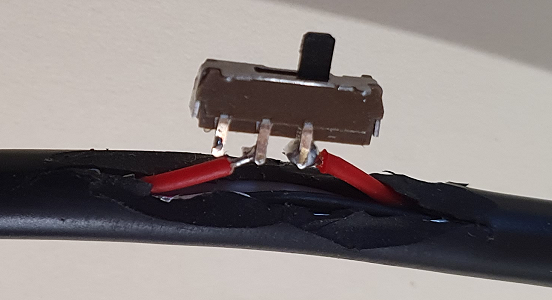
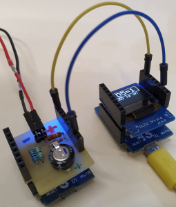

# D1 mini: 5V-Eingang mit Spannungs&uuml;berwachung
Sketch: D1_ex56_5VinMonitor1.ino, Version 2021-02-27   
[--> English Version](./README.md "English Version")   

Dieses Programm dient zum Testen des Eigenbau-Shields `D1_5VinMonitor1` sowie zum Feststellen, wie lange der D1 mini nach dem Abschalten der Versorgungsspannung noch weiterarbeitet (Abschaltverz&ouml;gerung). Dazu muss die 5V Spannungsversorgung &uuml;ber das Shield und nicht &uuml;ber den USB-Anschluss erfolgen.   
Nach dem Einschalten liegt Pin D5 auf 1, die blaue LED blinkt mit 0,5Hz und der Systemzustand wird &uuml;ber die serielle Schnittstelle ausgegeben (zB. `D5=1__LED is on__`). Die zeitliche Steuerung erfolgt mit einem 10ms-Z&auml;hler.   
Wird die Versorgungsspannung abgeschaltet, geht D5 auf 0, die LED wird eingeschaltet, der 10ms-Z&auml;hler auf 0 gesetzt und der Z&auml;hlerstand als Millisekundenwert &uuml;ber die serielle Schnittstelle gesendet, bis die im Kondensator gespeicherte Energie verbraucht ist.   
__*Beispielausgabe auf der seriellen Schnittstelle*__
```   
D5=1__LED is on__
D5=1__LED is off__
D5=1__LED is on__
D5=0__LED is on!
00ms
10ms
20ms
30ms
40ms
50ms
60ms
70ms
80ms
90ms
100ms
110ms
120ms
130ms
140ms
150ms
160ms
170ms
180ms
190ms
Exception in thread rx:
...
```   
### Anzeige der seriellen Ausgabe   
Um die &uuml;ber die serielle Schnittstelle gesendeten Zeichen sichtbar zu machen (wie in der Beispielausgabe oben), gibt es mehrere M&ouml;glichkeiten:   
* Anschluss des TX- und GND-Pins &uuml;ber einen Pegelwandler an die serielle Schnittstelle eines PCs, Laptops etc. und Darstellung der Information mit einem Terminal-Programm (zB Realterm).   
* Verwendung eines USB-Kabels bei dem die 5V-Leitung unterbrochen ist oder (zB durch einen Schalter) unterbrochen werden kann (siehe Bild 1). Die Anzeige der Werte kann dann im Monitor der Programmiersoftware erfolgen (Arduino-IDE, Visual Studio Code, ...).   
    
_Bild 1: USB-Kabel mit Schalter in der 5V-Leitung_   
* Verwendung eines zweiten D1 minis mit 0.66"-OLED-Shield, auf dem das Programm `D1_oop89_serial_screen13` l&auml;uft und Verbindung von TX mit RX bzw. GND mit GND. Die Anzeige erfolgt dann auf dem OLED (siehe Bild 2).   
    
_Bild 2: D1 mini mit D1_5VinMonitor1-Shield und D1 mini mit 0.66"-OLED-Shield_   